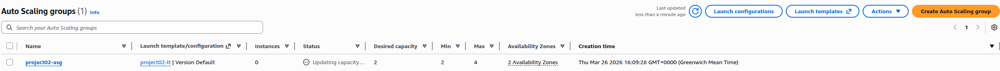
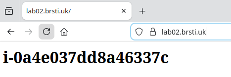
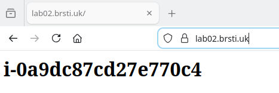

# Application Load Balancer Lab

## Objective

Deploy two EC2 instances behind an ALB with the following:
- Two EC2 instances across different availability zones
- An Application Load Balancer with HTTP listener
- A Target Group with health checks
- Security groups enforcing ALB-only access to EC2

### Architecture


> With the introduction of [Regional NAT Gateways](/notes/03-networking.md#part-8-nat-gateway) the architecture can be simplified even further, reducing the amount of NAT gateways to 1, eliminating public subnets for the NAT Gateway (you will still require a public subnet for an internet-facing ALB)
---

### 1. Launch EC2 Instances

Launch two EC2 instances in the same VPC, using different availability zones where possible. Install a simple web server using [user data](/notes/04-ec2.md#part-5-user-data). Each instance should return different content for testing.

User data:

**Instance 1:**
```bash
#!/bin/bash
yum install -y httpd
echo "<h1>Server 1</h1>" > /var/www/html/index.html
systemctl start httpd
systemctl enable httpd
```
**Instance 2:**
```bash
#!/bin/bash
yum install -y httpd
echo "<h1>Server 2</h1>" > /var/www/html/index.html
systemctl start httpd
systemctl enable httpd
```
> SSM Session Manager is installed and running by default on the Amazon Linux AMI, if using other images you may want to [install](https://docs.aws.amazon.com/systems-manager/latest/userguide/ami-preinstalled-agent.html) via user data


---

### 2. Set Up SSM Agent

1. Go to IAM console > Roles > Create role
2. Trusted entity: AWS service > Use case: EC2
3. Next > search for AmazonSSMManagedInstanceCore > tick it
4. Next > Role name: EC2-SSM-Role
5. Create role
6. Go to your EC2 instance > Actions > Security > Modify IAM role > attach EC2-SSM-Role


---

### 3. Set Up the ALB

Create an ALB in two public subnets with an HTTP (port 80) listener.
   1. EC2 console > Load Balancers > Create Load Balancer
   2. Choose Application Load Balancer
   3. Name: project02-alb
   4. Scheme: Internet-facing
   5. IP type: IPv4
   6. Network mapping: select project02-vpc, then pick both public subnets (eu-west-2a and eu-west-2b)
   7. Security group: create or select one that allows HTTP (80) from anywhere (0.0.0.0/0)
   8. Listener: HTTP port 80, forward to project02-tg (see next section)
   9. Create


Create a Target Group and register both EC2 instances. Configure a health check on the root path `/`.
   1. EC2 console > left sidebar > Target Groups (under "Load Balancing")
   2. Create target group
   3. Target type: Instances
   4. Name: project02-tg
   5. Protocol: HTTP, Port: 80
   6. VPC: project02-vpc
   7. Health check protocol: HTTP, path: /
   8. Click Next
   9. Tick both EC2 instances, click Include as pending below
   10. Click Create target group


---

### 4. Security Groups

**ALB SG** - allow HTTP from anywhere


**EC2 SG** - allow HTTP only from the ALB SG. Do not allow direct public access to EC2.


---

### 5. Testing

Visit the ALB DNS name. Refresh to verify traffic alternates between both instances. Confirm health checks are healthy.

Test the web-server:


health check:


---

### 6. Bonus

- Point your DNS name to your ALB
- HTTPS listeneer with ACM
- Validate certificate
- Add HTTPS listener to ALB
- 

**Add a Cloudflare DNS  name and point it to your ALB DNS:**


**Add an HTTPS listener with ACM (AWS Certificate Manager):**

1. Request a certificate in ACM
   - Go to AWS Certificate Manager > Request certificate
   - Request a public certificate
   - Domain name: lab02.brsti.uk
   - Validation method: DNS validation
   - Request

    

2. Validate the certificate
   - In ACM, click on your pending certificate
   - Copy the CNAME name and CNAME value it gives you
   - Go to Cloudflare DNS and add that CNAME record
   - Wait a few minutes for ACM to validate (status changes to Issued)
  
    

3. Add HTTPS listener to ALB
   - Go to EC2 > Load Balancers > project02-alb
   - Listeners tab > Add listener
   - Protocol: HTTPS, Port: 443
   - Default action: Forward to project02-tg
   - Default SSL certificate: select your lab02.brsti.uk certificate
   - Add
  
    

4. Update ALB security group
   - Add inbound rule: HTTPS (port 443) from 0.0.0.0/0

    

Optional but recommended - Edit your HTTP (port 80) listener to redirect to HTTPS instead of forwarding to the target group.


**Add an Auto Scaling Group behind the ALB.**

1. Create a Launch Template
   - EC2 > Launch Templates > CreateName: project02-lt
   - AMI: Amazon Linux
   - Instance type: t2.micro
   - Security group: your EC2 SG (HTTP from ALB SG only)
   - IAM instance profile: EC2-SSM-Role
   - User data:
```bash
#!/bin/bash
yum install -y httpd
INSTANCE_ID=$(ec2-metadata -i | cut -d ' ' -f2)
echo "<h1>$INSTANCE_ID</h1>" > /var/www/html/index.html
systemctl start httpd
systemctl enable httpd
```

1. Create Auto Scaling Group
  -  EC2 > Auto Scaling Groups > Create
  -  Name: project02-asg
  -  Launch template: project02-lt
  -  VPC: project02-vpc, select both private subnets
  - Attach to existing target group: project02-tg
  -  Turn on ELB health checks
  -  Desired: 2, Min: 2, Max: 4
  -  Create



3. Clean up - Once ASG instances show healthy in the target group, terminate your original two EC2 instances.


