# S3 Static Website + CloudFront CDN + Route53 

## Objective

Create a production-ready static website deployed on:
- S3 (for hosting)
- CloudFront (for CDN + HTTPS)
- Route53 (for the domain)

### Architecture

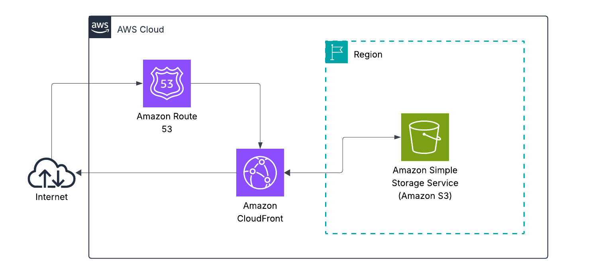

---

### 1. Static Website Bucket

**Create an S3 bucket**
  1. Go to S3 in the AWS Console
  2. Click Create bucket
  3. Account Regional namespace (recommended)
  4. Set a globally unique Bucket name (e.g. my-static-site-2024)
  5. Under Object Ownership, select ACLs disabled
  6. Under Block Public Access, uncheck "Block all public access"
  7. Confirm the warning checkbox
  8. Click Create bucket

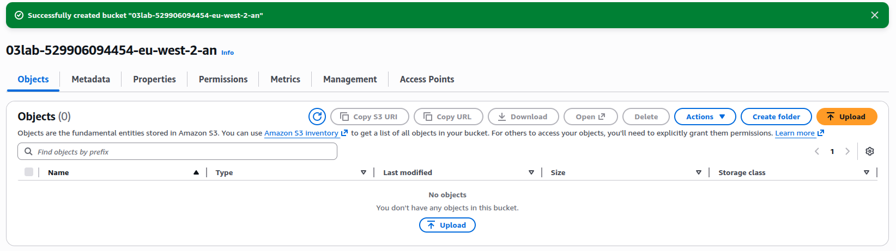

**Enable Static Website Hosting**
  1. Click your bucket, go to the Properties tab
  2. Scroll to Static website hosting, click Edit
  3. Set to Enable
  4. Set Hosting type to Host a static website
  5. Set Index document to index.html
  6. Set Error document to error.html
  7. Click Save changes
   
      Save the Bucket website endpoint URL shown after saving.

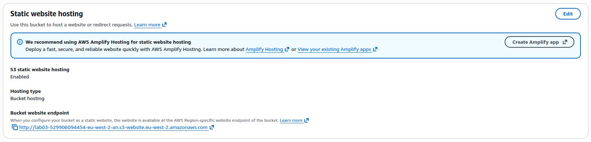

**Upload a simple index.html and error.html**
  1. Go to the Objects tab, click Upload
  2. Add both files, click Upload

```html
<!-- index.html -->
<!DOCTYPE html>
<html lang="en">
  <head>
    <meta charset="UTF-8" />
    <meta name="viewport" content="width=device-width, initial-scale=1.0" />
    <title>My Static Site</title>
    <style>
      body {
        font-family: Arial, sans-serif;
        display: flex;
        justify-content: center;
        align-items: center;
        height: 100vh;
        margin: 0;
        background-color: #f0f4f8;
      }
      .container {
        text-align: center;
        padding: 2rem;
        background: white;
        border-radius: 8px;
        box-shadow: 0 2px 8px rgba(0, 0, 0, 0.1);
      }
      h1 { color: #232f3e; }
      p { color: #555; }
    </style>
  </head>
  <body>
    <div class="container">
      <h1>Hello from S3!</h1>
      <p>Static website hosted on Amazon S3 with CloudFront CDN.</p>
    </div>
  </body>
</html>
```

```html
<!-- error.html -->
<!DOCTYPE html>
<html lang="en">
  <head>
    <meta charset="UTF-8" />
    <meta name="viewport" content="width=device-width, initial-scale=1.0" />
    <title>Page Not Found</title>
    <style>
      body {
        font-family: Arial, sans-serif;
        display: flex;
        justify-content: center;
        align-items: center;
        height: 100vh;
        margin: 0;
        background-color: #f0f4f8;
      }
      .container {
        text-align: center;
        padding: 2rem;
        background: white;
        border-radius: 8px;
        box-shadow: 0 2px 8px rgba(0, 0, 0, 0.1);
      }
      h1 { color: #e53e3e; }
      p { color: #555; }
      a { color: #232f3e; }
    </style>
  </head>
  <body>
    <div class="container">
      <h1>404 - Page Not Found</h1>
      <p>The page you are looking for does not exist.</p>
      <a href="/">Go back home</a>
    </div>
  </body>
</html>
```

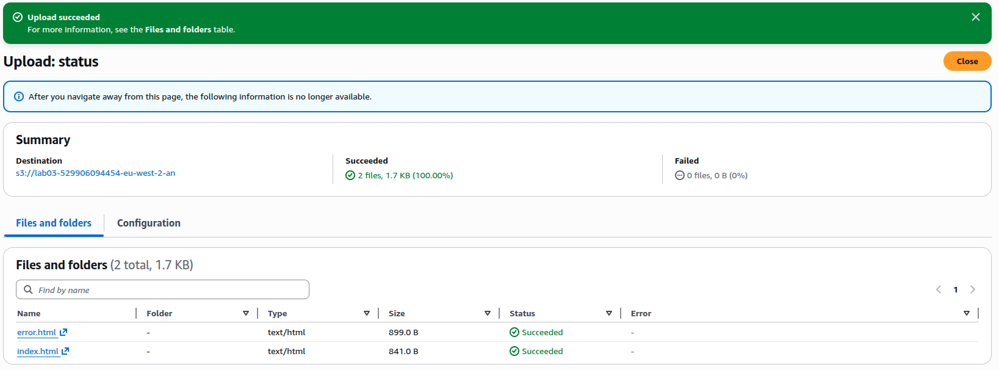

**Make bucket objects publicly readable (bucket policy)**
  1. Go to the Permissions tab
  2. Scroll to Bucket policy, click Edit
  3. Paste this (replace your-bucket-name):
   
```JSON
    {
    "Version": "2012-10-17",
    "Statement": [
        {
        "Sid": "PublicReadGetObject",
        "Effect": "Allow",
        "Principal": "*",
        "Action": "s3:GetObject",
        "Resource": "arn:aws:s3:::your-bucket-name/*"
        }
    ]
    }
```
  4. Click Save changes

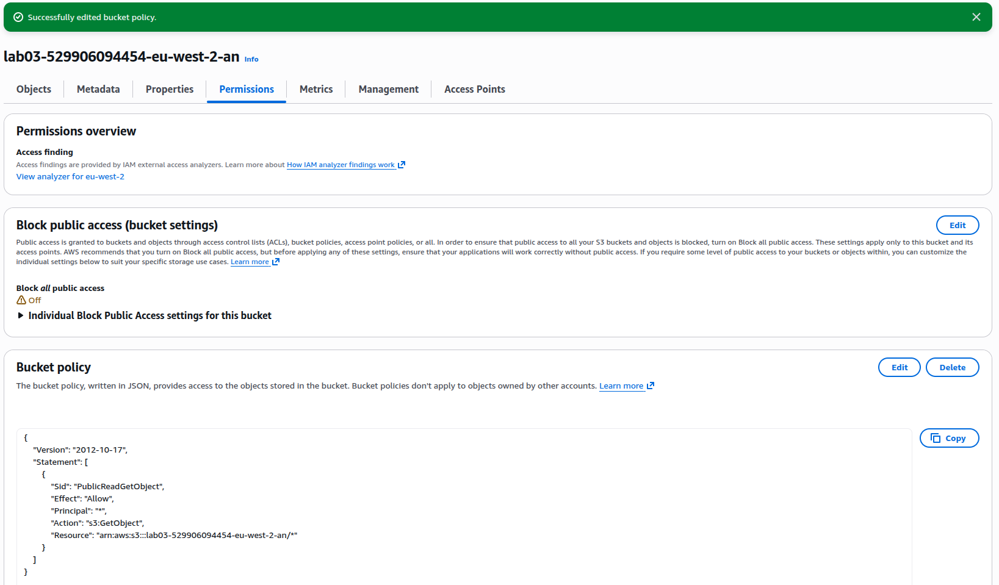


---

### 2. Set Up CloudFront

**Create the Distribution**

1. Go to **CloudFront** in the AWS Console
2. Click **Create distribution**
3. Under **Origin**: 
   - Origin type: Amazon S3
   - Origin: select your S3 bucket's website endpoint (ends in `.s3-website-<region>.amazonaws.com`) - use the website endpoint, not the bucket itself
4. Under **Web Application Firewall (WAF)**, select **Do not enable**
5. Click **Create distribution**

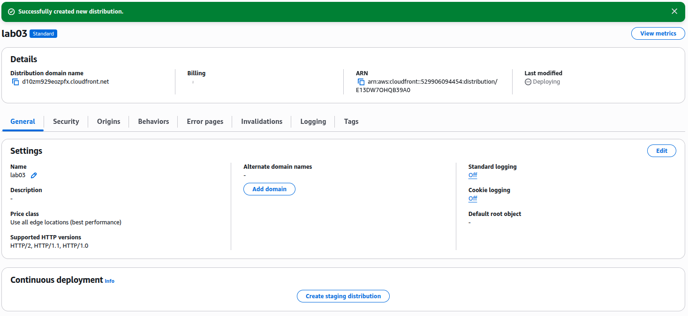

**Wait for Deployment**

- Status will show **Deploying** - takes 5-10 minutes
- Once status changes to **Enabled**, your distribution is live

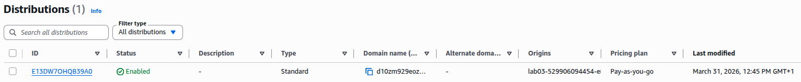

**Get your CloudFront URL**

- Copy the **Distribution domain name** (e.g. `d1234abcd.cloudfront.net`)
- Visit it in your browser - you should see your index page over HTTPS

---

### 3. Custom Domain Setup (Cloudflare DNS + ACM + CloudFront)

> Route53 is skipped here - Cloudflare is used as the DNS provider instead.

**Request an SSL Certificate in ACM**

1. Switch your AWS region to **us-east-1 (N. Virginia)** - CloudFront only reads certificates from this region
2. Go to **Certificate Manager (ACM)**
3. Click **Request**, then **Request a public certificate**
4. Add domain names: `example.com` and `*.example.com`
5. Validation method: **DNS validation**
6. Click **Request**
7. Click into the pending certificate - note the CNAME name and value shown (you will add these to Cloudflare next)

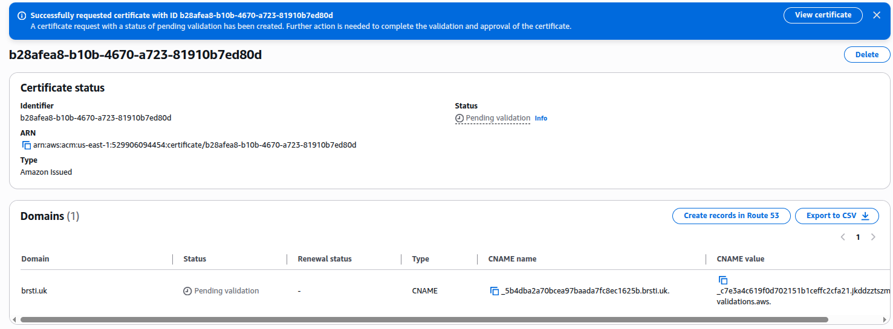

**Add ACM Validation Record in Cloudflare**

1. Log into Cloudflare, go to your domain
2. Go to **DNS** > **Records**, click **Add record**
   - Type: **CNAME**
   - Name: paste the CNAME name from ACM (trim the domain suffix if Cloudflare adds it automatically)
   - Target: paste the CNAME value from ACM
   - Proxy: **DNS only (grey cloud)**
3. Save
4. Wait for ACM certificate status to change to **Issued** (5-10 minutes)

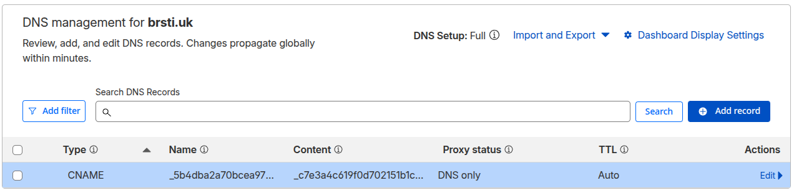

**Attach the Certificate to CloudFront**

1. Go to your CloudFront distribution, click **Edit**
2. Under **Alternate domain names (CNAMEs)**, add `example.com` and `www.example.com`
3. Under **Get TLS certificate**, select the certificate you just issued
4. Click **Save changes** and wait for redeployment

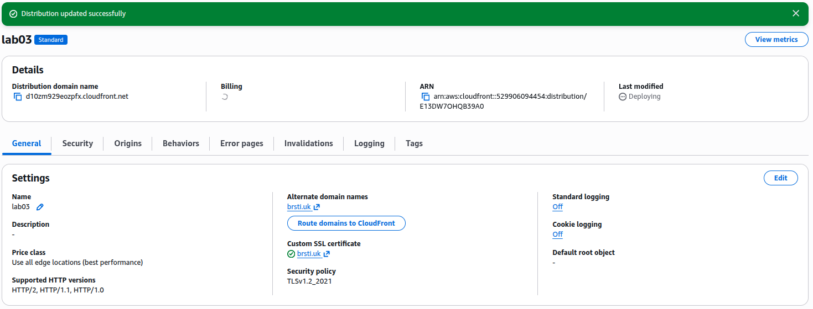

**Add DNS Records in Cloudflare**

1. Go to Cloudflare **DNS** > **Records**, click **Add record**
   - Type: **CNAME**
   - Name: `@` (root domain)
   - Target: your CloudFront distribution domain (e.g. `d10zm929eozpfx.cloudfront.net`)
   - Proxy: **DNS only (grey cloud)** - must be grey cloud or SSL will break
2. Repeat for `www`:
   - Type: **CNAME**
   - Name: `www`
   - Target: same CloudFront distribution domain
   - Proxy: **DNS only (grey cloud)**

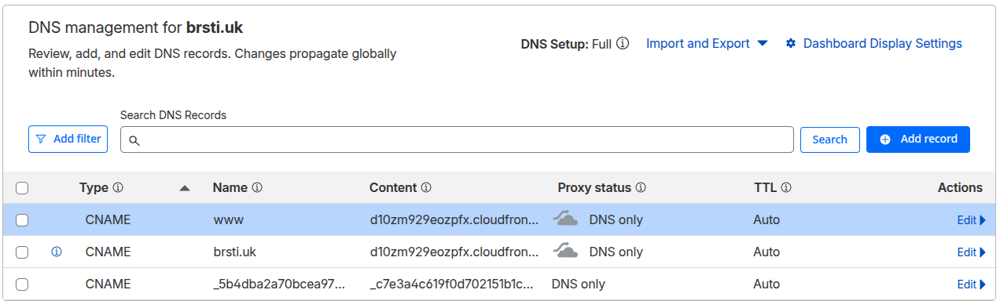

**Verify**

- Visit `https://example.com` - you should see your site over HTTPS with your custom domain

---

### 4. Testing

**S3 Origin**
- Visit the S3 website endpoint directly (`http://your-bucket.s3-website-us-east-1.amazonaws.com`)
- Expected: index page loads over HTTP

**CloudFront URL**
- Visit your CloudFront domain (`https://d1234abcd.cloudfront.net`)
- Expected: index page loads over HTTPS

**Custom Domain**
- Visit `https://example.com` and `https://www.example.com`
- Expected: both load correctly

**HTTP Redirect**
- Visit `http://example.com`
- Expected: automatically redirects to `https://example.com`

**Cache Hit**
- Open browser DevTools > Network tab
- Reload the page and click the main document request
- Expected: response header `X-Cache: Hit from cloudfront`

**Error Page**
- Visit `https://example.com/doesnotexist`
- Expected: your `error.html` page loads

---

### Bonus

---
---

#### Add a CI/CD pipeline using GitHub Actions > automatic deploy to S3

**Prerequisites**
- Your site files are in a [GitHub repository](https://github.com/ei-sei/static-site)
- You have the S3 bucket name and CloudFront distribution ID ready

**1. Create an IAM User for GitHub Actions**

1. Go to **IAM** in the AWS Console
2. Click **Users**, then **Create user**
3. Name it `github-actions-s3-deploy`
4. Click **Next**, select **Attach policies directly**
5. Click **Create policy**, paste this (replace `your-bucket-name`):

```json
{
  "Version": "2012-10-17",
  "Statement": [
    {
      "Effect": "Allow",
      "Action": ["s3:PutObject", "s3:DeleteObject", "s3:ListBucket"],
      "Resource": [
        "arn:aws:s3:::your-bucket-name",
        "arn:aws:s3:::your-bucket-name/*"
      ]
    },
    {
      "Effect": "Allow",
      "Action": "cloudfront:CreateInvalidation",
      "Resource": "*"
    }
  ]
}
```

6. Name the policy `github-actions-s3-deploy-policy`, click **Create policy**
7. Attach the policy to the user, click **Create user**
8. Click into the user, go to **Security credentials**, click **Create access key**
9. Select **Third-party service**, create and download the key

**2. Add Secrets to GitHub**

1. Go to your GitHub repo - **Settings** - **Secrets and variables** - **Actions**
2. Add these secrets:
   - `AWS_ACCESS_KEY_ID` - from the IAM access key
   - `AWS_SECRET_ACCESS_KEY` - from the IAM access key
   - `AWS_REGION` - e.g. `us-east-1`
   - `S3_BUCKET` - your bucket name
   - `CLOUDFRONT_DISTRIBUTION_ID` - from your CloudFront distribution (ID)

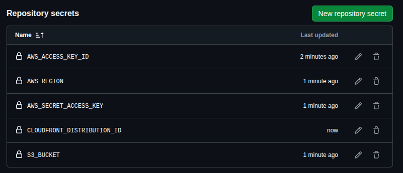

**3. Create the GitHub Actions Workflow**

Create `.github/workflows/deploy.yml` in your repo:

```yaml
name: Deploy to S3

on:
  push:
    branches:
      - main

jobs:
  deploy:
    runs-on: ubuntu-latest
    steps:
      - name: Checkout code
        uses: actions/checkout@v4

      - name: Configure AWS credentials
        uses: aws-actions/configure-aws-credentials@v4
        with:
          aws-access-key-id: ${{ secrets.AWS_ACCESS_KEY_ID }}
          aws-secret-access-key: ${{ secrets.AWS_SECRET_ACCESS_KEY }}
          aws-region: ${{ secrets.AWS_REGION }}

      - name: Sync files to S3
        run: aws s3 sync . s3://${{ secrets.S3_BUCKET }} --delete --exclude ".git/*" --exclude ".github/*"

      - name: Invalidate CloudFront cache
        run: aws cloudfront create-invalidation --distribution-id ${{ secrets.CLOUDFRONT_DISTRIBUTION_ID }} --paths "/*"
```

**4. Test It**

1. Push any change to `main`
2. Go to your repo - **Actions** tab - you should see the workflow running
3. Once complete, visit your site - the change should be live

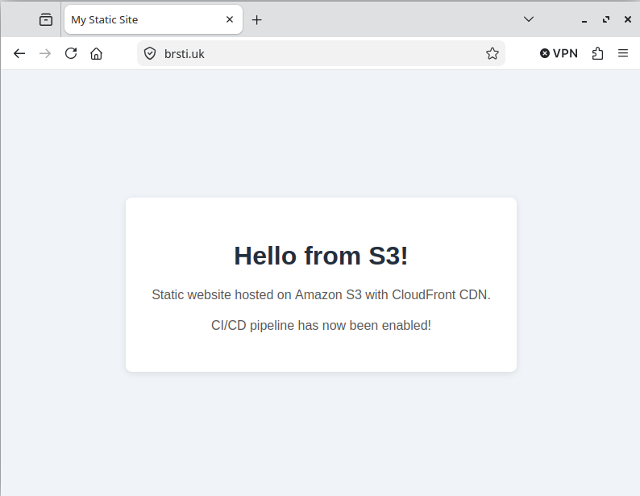

---

#### Add security headers through CloudFront functions

Security headers tell browsers how to behave when loading your site - they protect against common attacks like clickjacking, XSS, and protocol downgrade attacks.

**1. Create the CloudFront Function**

1. Go to **CloudFront** in the AWS Console
2. In the left sidebar, click **Functions**
3. Click **Create function**
4. Name it `add-security-headers`
5. Paste this code:

```javascript
function handler(event) {
    var response = event.response;
    var headers = response.headers;

    headers['strict-transport-security'] = { value: 'max-age=31536000; includeSubDomains; preload' };
    headers['x-content-type-options'] = { value: 'nosniff' };
    headers['x-frame-options'] = { value: 'DENY' };
    headers['x-xss-protection'] = { value: '1; mode=block' };
    headers['referrer-policy'] = { value: 'strict-origin-when-cross-origin' };

    return response;
}
```

6. Click **Save changes**

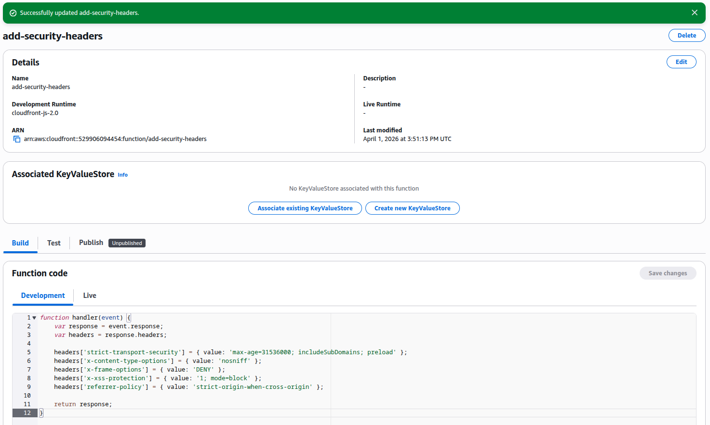

**2. Test the Function**

1. Click the **Test** tab
2. Under Event type, select **Viewer Response**
3. Click **Test function**
4. Confirm the security headers appear in the output

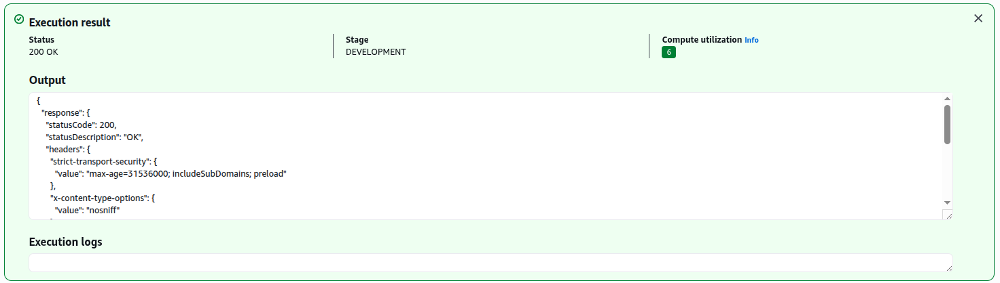

**3. Publish the Function**

1. Click the **Publish** tab
2. Click **Publish function**

**4. Attach to Your Distribution**

1. Go to your CloudFront distribution, click the **Behaviours** tab
2. Select the default behaviour, click **Edit**
3. Scroll to **Function associations**
4. Under **Viewer response**, select **CloudFront Functions** and choose `add-security-headers`
5. Click **Save changes** and wait for redeployment

**5. Verify**

1. Visit your site
2. Open browser DevTools - **Network** tab
3. Click the main document request, go to **Response Headers**
4. Confirm the security headers are present

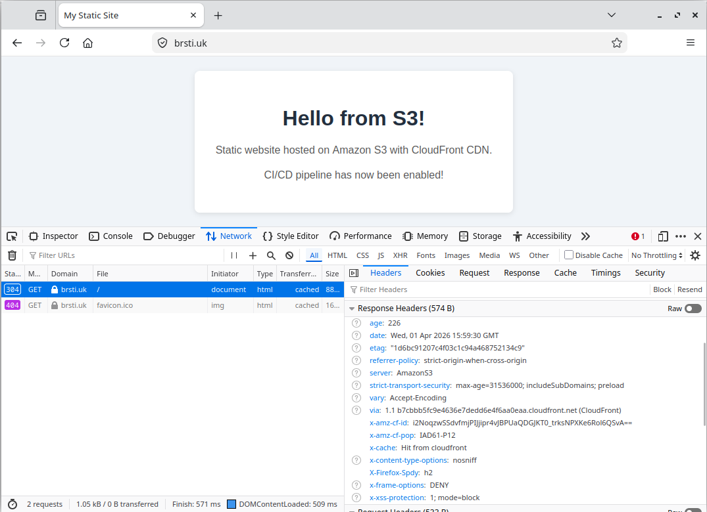

---

#### Add Lambda@Edge to rewrite URLs

This rewrites clean URLs so `/about` serves `/about/index.html` from S3 without the user needing to type the full path.

**1. Create the Lambda Function**

1. Go to **Lambda** in the AWS Console - make sure you are in **us-east-1 (N. Virginia)** - Lambda@Edge must be created here
2. Click **Create function**
3. Select **Author from scratch**
4. Name it `cloudfront-url-rewriter`
5. Runtime: **Node.js 24.x**
6. Click **Create function**
7. Replace the default code with:

```javascript
export const handler = async (event) => {
    const request = event.Records[0].cf.request;
    const uri = request.uri;

    // if the URI has no file extension, append /index.html
    if (!uri.includes('.')) {
        request.uri = uri.replace(/\/?$/, '/index.html');
    }

    return request;
};
```

8. Click **Deploy**

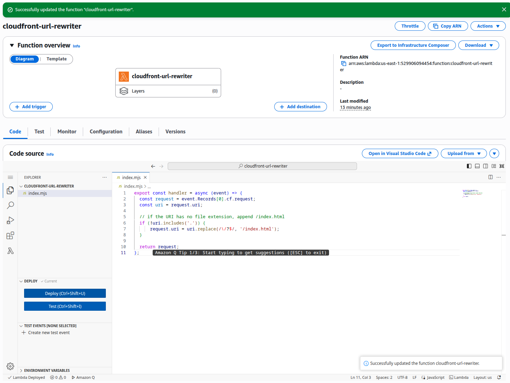

**2. Publish a Version**

Lambda@Edge requires a published version - you cannot use `$LATEST`.

1. Click **Actions**, then **Publish new version**
2. Add a description (e.g. `initial`) and click **Publish**
3. Note the ARN shown - it will end in `:1`

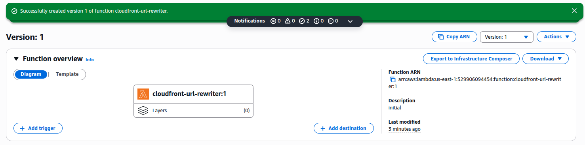

**3. Add Permissions**

Lambda@Edge needs permission to be invoked by CloudFront.

1. Click the **Configuration** tab, then **Permissions**
2. Click the execution role name to open it in IAM
3. Click **Trust relationships**, then **Edit trust policy**
4. Add `edgelambda.amazonaws.com` to the trusted services:

```json
{
  "Version": "2012-10-17",
  "Statement": [
    {
      "Effect": "Allow",
      "Principal": {
        "Service": [
          "lambda.amazonaws.com",
          "edgelambda.amazonaws.com"
        ]
      },
      "Action": "sts:AssumeRole"
    }
  ]
}
```

5. Click **Update policy**

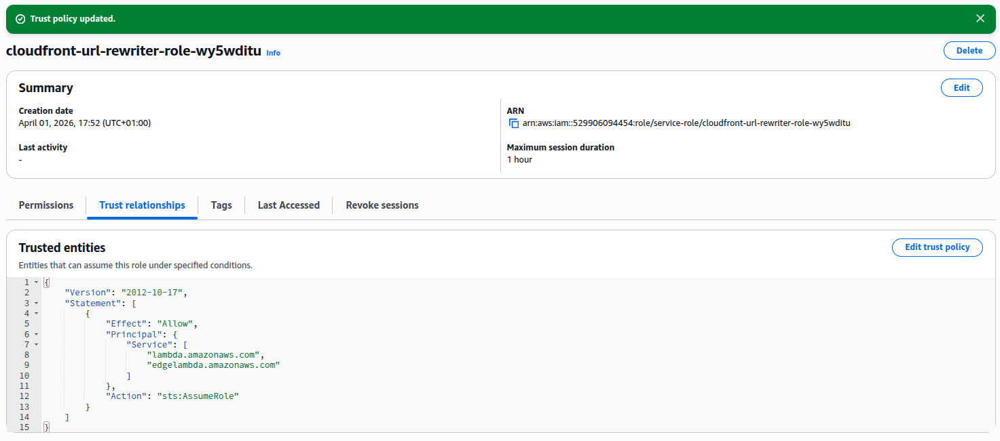

**4. Attach to Your Distribution**

1. Go to your CloudFront distribution, click the **Behaviors** tab
2. Select the default behavior, click **Edit**
3. Scroll to **Function associations**
4. Under **Origin request**, select **Lambda@Edge**
5. Paste the Lambda function ARN (including the version number, e.g. `arn:aws:lambda:us-east-1:123456789:function:cloudfront-url-rewriter:1`)
6. Click **Save changes** and wait for redeployment

**5. Verify**

- Create a folder `about/` in your S3 bucket with an `index.html` inside it
- Visit `https://example.com/about` - it should load without needing `/about/index.html` in the URL
- 
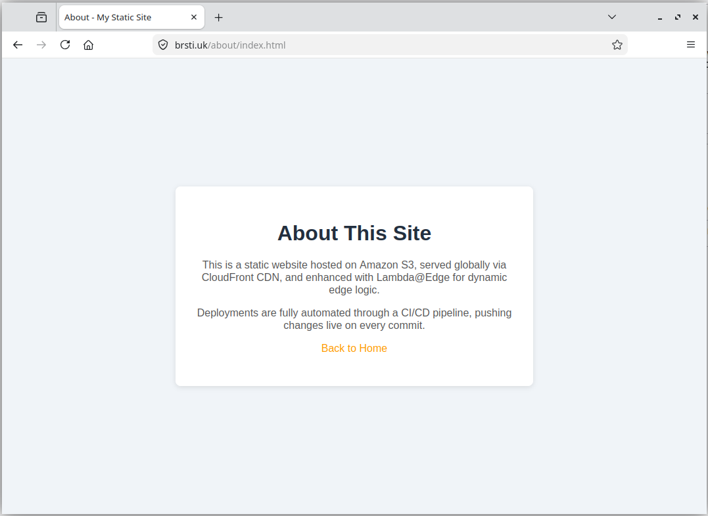

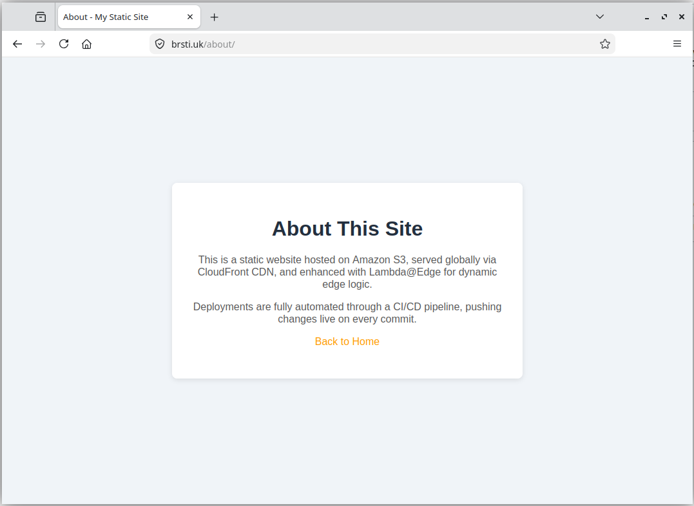