# Serverless API with Lambda, IAM, and API Gateway

## Objective

Build a simple REST API using API Gateway > Lambda > DynamoDB.
Your API should accept a POST request, store the data, and return a response.

### Architecture

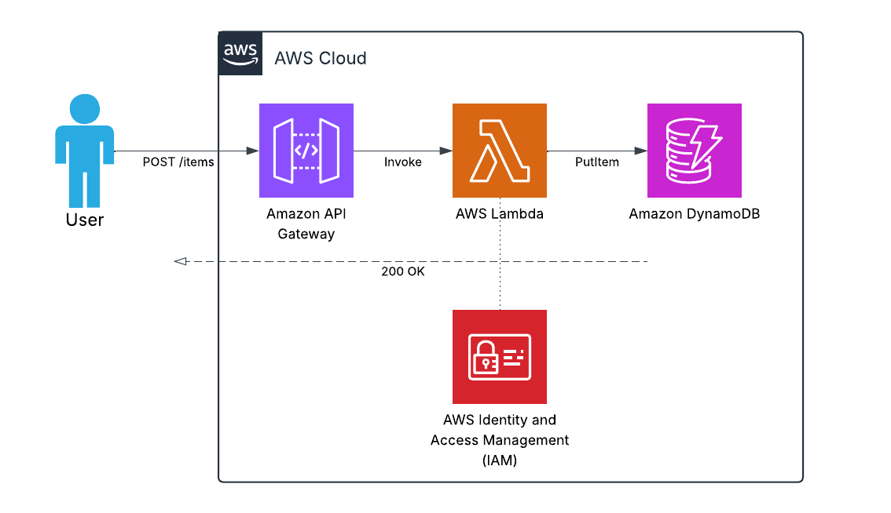

---

### 1. Create the DynamoDB Table

1. Go to **DynamoDB** in the AWS Console
2. Click **Create table**
3. Set the following:
   - Table name: `students`
   - Partition key: `id` (String)
4. Under **Table settings**, select **On-demand** capacity mode
5. Click **Create table**

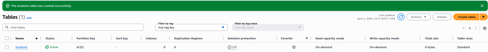

---

### 2. Create the Lambda Function

**Create the function**

1. Go to **Lambda** in the AWS Console
2. Click **Create function**
3. Select **Author from scratch**
4. Set the following:
   - Function name: `submitStudent`
   - Runtime: **Python 3.14**
5. Click **Create function**

**Add the function code**

Replace the default code with the following:

Python:
```python
import json
import boto3
import uuid
from datetime import datetime

dynamodb = boto3.resource('dynamodb')
table = dynamodb.Table('students')

def lambda_handler(event, context):
    try:
        body = json.loads(event['body'])

        item = {
            'id': str(uuid.uuid4()),
            'timestamp': datetime.utcnow().isoformat(),
            **body
        }

        table.put_item(Item=item)

        return {
            'statusCode': 200,
            'headers': { 'Content-Type': 'application/json' },
            'body': json.dumps({ 'message': 'Student saved', 'id': item['id'] })
        }

    except Exception as e:
        return {
            'statusCode': 500,
            'body': json.dumps({ 'error': str(e) })
        }
```

Click **Deploy**.

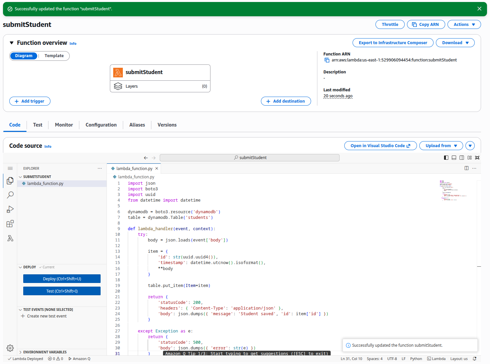

---

### 3. Build the API Gateway REST API

**Create the API**

1. Go to **API Gateway** in the AWS Console
2. Click **Create API**
3. Select **REST API**, click **Build**
4. Select **New API**
5. Set the following:
   - API name: `students-api`
6. Click **Create API**

**Create the endpoint**

1. Click **Create resource**
   - Resource name: `submit`
   - Enable CORS: checked
2. Click **Create resource**
3. Select the `/submit` resource, click **Create method**
   - Method type: **POST**
   - Integration type: **Lambda function**
   - Lambda proxy integration: **on**
   - Select your `submitStudent` function
4. Click **Create method**

**Deploy the API**

1. Click **Deploy API**
2. Stage: **New stage**
3. Stage name: `prod`
4. Click **Deploy**
5. Copy the **Invoke URL** shown (e.g. `https://<api-id>.execute-api.<region>.amazonaws.com/prod`)

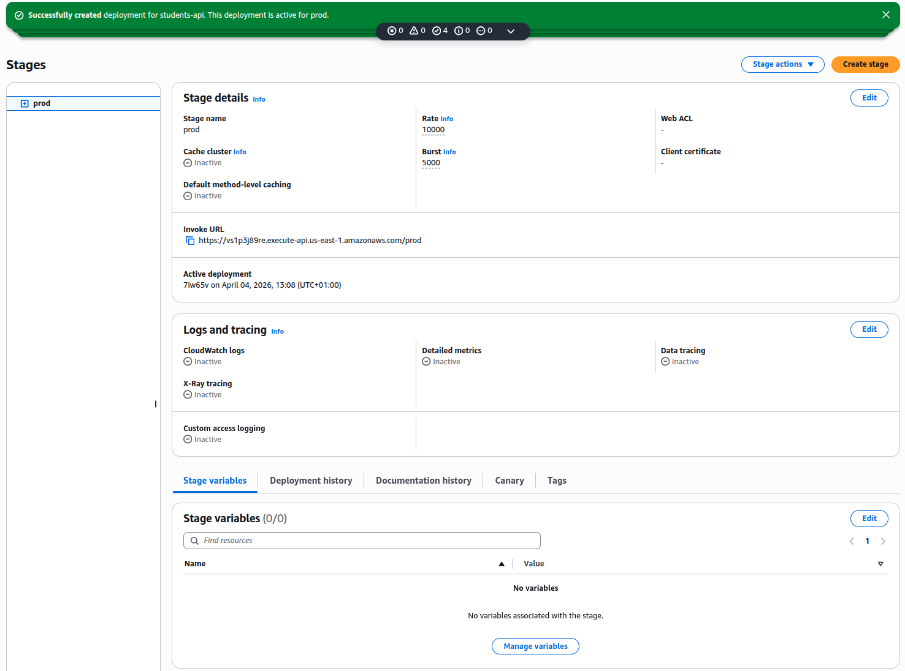

---

### 4. IAM Permissions

Your Lambda execution role must allow write access to DynamoDB and basic logging - no over-permissive policies.

1. Go to **IAM** in the AWS Console
2. Click **Roles**, find the role created for your Lambda (e.g. `submitStudent-role-xxxx`)
3. Click **Add permissions**, then **Create inline policy**
4. Paste this (replace `your-account-id` and `your-region`):

```json
{
  "Version": "2012-10-17",
  "Statement": [
    {
      "Effect": "Allow",
      "Action": "dynamodb:PutItem",
      "Resource": "arn:aws:dynamodb:your-region:your-account-id:table/students"
    },
    {
      "Effect": "Allow",
      "Action": [
        "logs:CreateLogGroup",
        "logs:CreateLogStream",
        "logs:PutLogEvents"
      ],
      "Resource": "arn:aws:logs:*:*:*"
    }
  ]
}
```

5. Name the policy `submitStudent-policy`, click **Create policy**

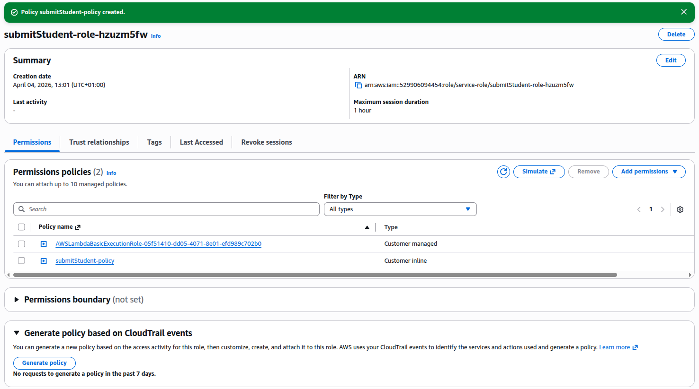

---

### 5. Testing

**curl**

```bash
curl -X POST https://vs1p3j89re.execute-api.us-east-1.amazonaws.com/prod/submit \
  -H "Content-Type: application/json" \
  -d '{"name": "Mo", "module": "AWS"}'
```

Expected response:
```json
{ "message": "Student saved", "id": "some-uuid" }
```
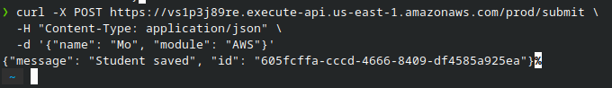

**Insonmia**

- Method: `POST`
- URL: `https://vs1p3j89re.execute-api.us-east-1.amazonaws.com/prod/submit `
- Body: raw JSON
```json
{ "name": "Mo", "module": "AWS" }
```

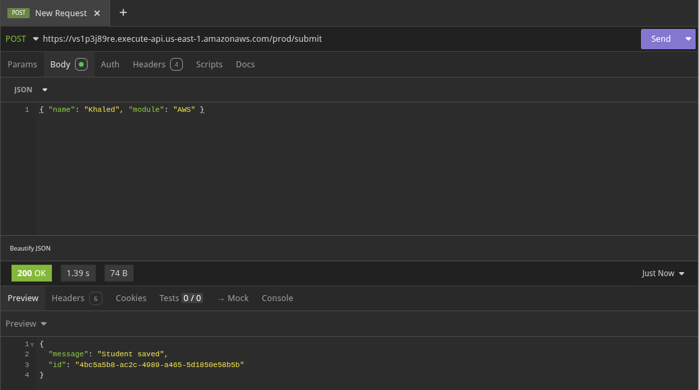

**Check DynamoDB**

1. Go to **DynamoDB** - **Tables** - `students`
2. Click **Explore items**
3. Confirm your item appears with `id`, `timestamp`, `name`, and `module`

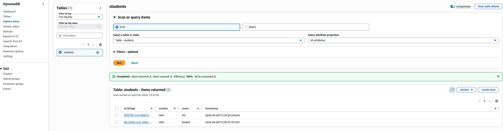

**Check CloudWatch logs**

1. Go to **CloudWatch** > Logs > Logs Insights
2. Find `/aws/lambda/submitStudent`
3. Click the latest log stream and confirm the function executed without errors

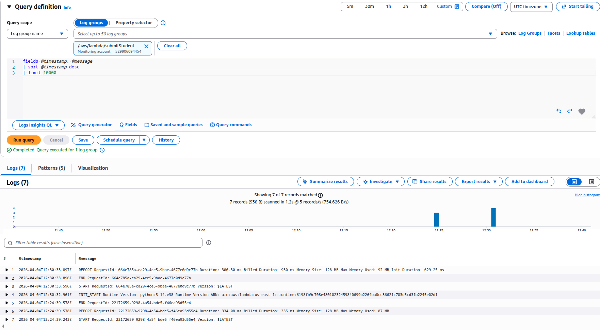

---

### Bonus

---
---


#### Add a GET /students endpoint to scan the table

**1. Create a new Lambda function**

1. Go to **Lambda**, click **Create function**
2. Name it `getStudents`, same runtime as before
3. Replace the default code with:

Python:
```python
import json
import boto3

dynamodb = boto3.resource('dynamodb')
table = dynamodb.Table('students')

def lambda_handler(event, context):
    try:
        result = table.scan()
        return {
            'statusCode': 200,
            'headers': { 'Content-Type': 'application/json' },
            'body': json.dumps(result['Items'])
        }
    except Exception as e:
        return {
            'statusCode': 500,
            'body': json.dumps({ 'error': str(e) })
        }
```


1. Click **Deploy**

**2. Add IAM permissions**

Add an inline policy to the `getStudents` execution role (same steps as section 4), replacing `PutItem` with `Scan`:

```json
{
  "Version": "2012-10-17",
  "Statement": [
    {
      "Effect": "Allow",
      "Action": "dynamodb:Scan",
      "Resource": "arn:aws:dynamodb:your-region:your-account-id:table/students"
    },
    {
      "Effect": "Allow",
      "Action": [
        "logs:CreateLogGroup",
        "logs:CreateLogStream",
        "logs:PutLogEvents"
      ],
      "Resource": "arn:aws:logs:*:*:*"
    }
  ]
}
```

**3. Add the endpoint to API Gateway**

1. Go to your `students-api` in API Gateway
2. Click **Create resource**
   - Resource name: `students`
   - Enable CORS: checked
3. Click **Create resource**
4. Select `/students`, click **Create method**
   - Method type: **GET**
   - Integration type: **Lambda function**
   - Lambda proxy integration: **on**
   - Select your `getStudents` function
5. Click **Create method**
6. Click **Deploy API**, select the `prod` stage, click **Deploy**

**4. Test**

```bash
curl https://vs1p3j89re.execute-api.us-east-1.amazonaws.com/prod/students
```

Expected response - a JSON array of all items in the table:
```json
[
  { "id": "some-uuid", "timestamp": "2026-04-04T...", "name": "Mo", "module": "AWS" }
]
```

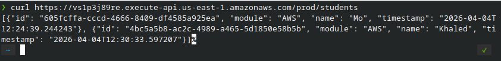

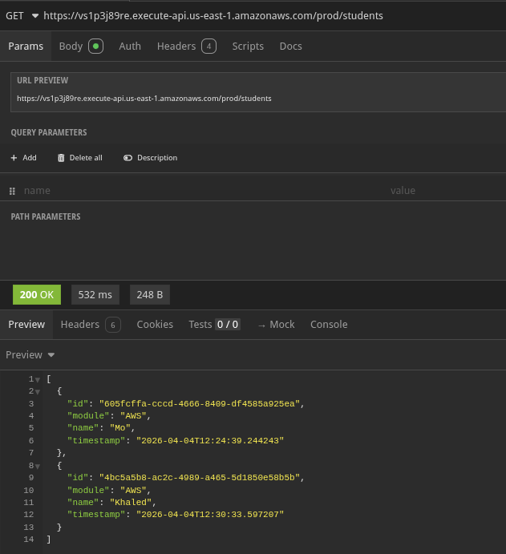

---

#### Add API keys + usage plans

API keys let you control and monitor who can call your API. A usage plan sets rate limits and quotas per key.

**1. Create a Usage Plan**

1. Go to **API Gateway**, click **Usage Plans** in the left sidebar
2. Click **Create**
3. Set the following:
   - Name: `basic-plan`
   - Rate: `10` requests per second
   - Burst: `20`
   - Quota: `1000` requests per month
4. Click **Create usage plan**
5. Click **Add stage**, select your `students-api` and `prod` stage
6. Click **Add to usage plan**

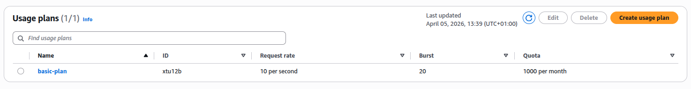

**2. Create an API Key**

1. Click **Create API key**
2. Name it `test-key`
3. Auto generate: **on**
4. Click **Save**
5. Click **Add API key to usage plan**, select `test-key`
6. Click the tick to confirm, then click **Done**

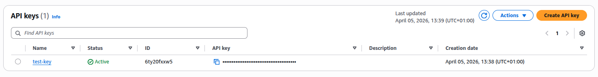

**3. Require the API Key on Your Endpoints**

1. Go to your `students-api`, click the **POST** method
2. Click **Method request**, click **Edit**
3. Tick **API key required**
4. Click **Save**
5. Repeat for **GET /students**
6. Click **Deploy API**, select `prod`, click **Deploy**

**4. Test**

Without a key - should return 403:
```bash
curl -X POST https://<api-id>.execute-api.<region>.amazonaws.com/prod/submit \
  -H "Content-Type: application/json" \
  -d '{"name": "Mo", "module": "AWS"}'
```

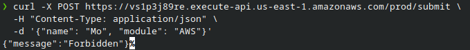

With a key - should succeed:
```bash
curl -X POST https://vs1p3j89re.execute-api.us-east-1.amazonaws.com/prod/submit \
  -H "Content-Type: application/json" \
  -H "x-api-key: pXGiC9tUGC5vaBff2mBHMaoX32100JXX9Da2hYwG" \
  -d '{"name": "Mo", "module": "AWS"}'
```
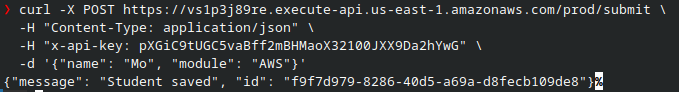

> Find your key value in API Gateway - **API Keys** - click `test-key` - **Show**.

---

#### Add WAF (AWS Web Application Firewall) with basic rate-limiting rules

WAF sits in front of your API Gateway and blocks requests that exceed a rate limit, protecting against abuse and simple DDoS attacks.

**1. Create a Web ACL**

1. Go to **WAF & Shield** in the AWS Console - make sure you are in the same region as your API Gateway
2. Click **Create protection pack (web ACL)**
3. Under **Tell us about your app** > App category: select **API**
4. Under **Select resources to protect**, click **Add AWS resources**, select your `students-api`
5. Under **Name and describe**, set name to `students-api-waf`
6. Click **Create protection pack (web ACL)**

**4. Test**

Send more than 100 requests in 5 minutes from the same IP and you should start receiving `403` responses. You can use a simple loop to test:

```bash
for i in {1..20}; do
  curl -s -o /dev/null -w "%{http_code}\n" \
    -X POST https://vs1p3j89re.execute-api.us-east-1.amazonaws.com/prod/submit \
    -H "Content-Type: application/json" \
    -H "x-api-key: pXGiC9tUGC5vaBff2mBHMaoX32100JXX9Da2hYwG" \
    -d '{"name": "Mo", "module": "AWS"}'
done
```

> Note: WAF has a cost of $5/month per web ACL plus $1 per million requests - delete it after the lab.

---

