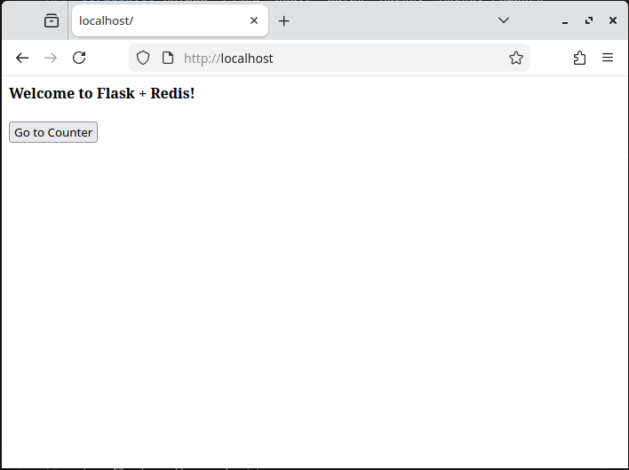
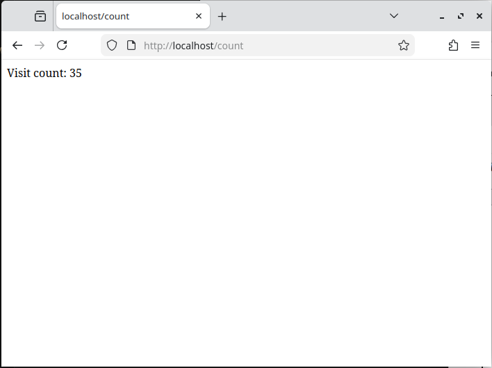
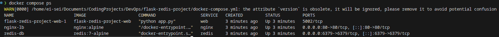

# Docker Lab Notebook

Documentation of my Docker and containerisation journey, including hands-on projects and notes.

## Featured Project - Flask + Redis

A multi-container web application built with Flask, Redis, and nginx, fully containerised with Docker Compose.

**What it does:** A visit counter web app where every page hit is tracked and persisted in Redis.

**What I built and documented:**
- Multi-container setup with Docker Compose (Flask, Redis, nginx)
- Redis AOF persistence so data survives container restarts
- Environment variable management via `.env` file
- nginx as a reverse proxy and load balancer
- Horizontal scaling with `docker compose --scale`

**Stack:** Python, Flask, Redis, nginx, Docker, Docker Compose

| Homepage | Counter |
|----------|---------|
|  |  |



[View Project README](flask-redis-project/README.md)

---

## Environment

- **Local:** Fedora 43 (KDE Plasma)
- **Remote:** GitHub, Docker Hub

## Repository Structure

```
DevOps/
├── README.md
├── assets/
│   ├── containers-vs-VMs.png
│   ├── docker-architecture.png
│   └── docker-overview.png
├── notes/
│   ├── 00-docker-setup.md
│   ├── 01-core-concepts.md
│   ├── 02-dockerfile.md
│   ├── 03-networking.md
│   ├── 04-compose.md
│   ├── 05-volumes.md
│   └── 06-best-practices.md
└── flask-redis-project/
    ├── README.md
    ├── docker-compose.yml
    ├── nginx.conf
    └── app/
        ├── app.py
        ├── Dockerfile
        └── requirements.txt
```
