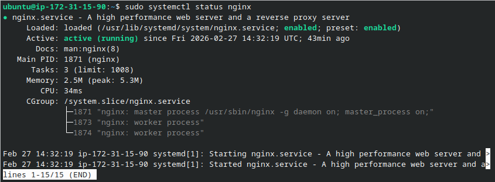
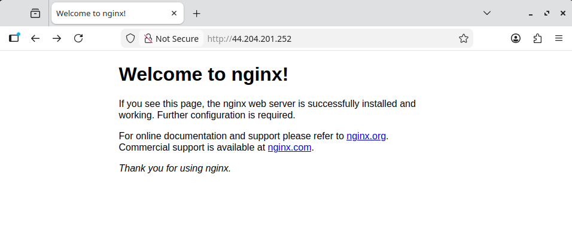
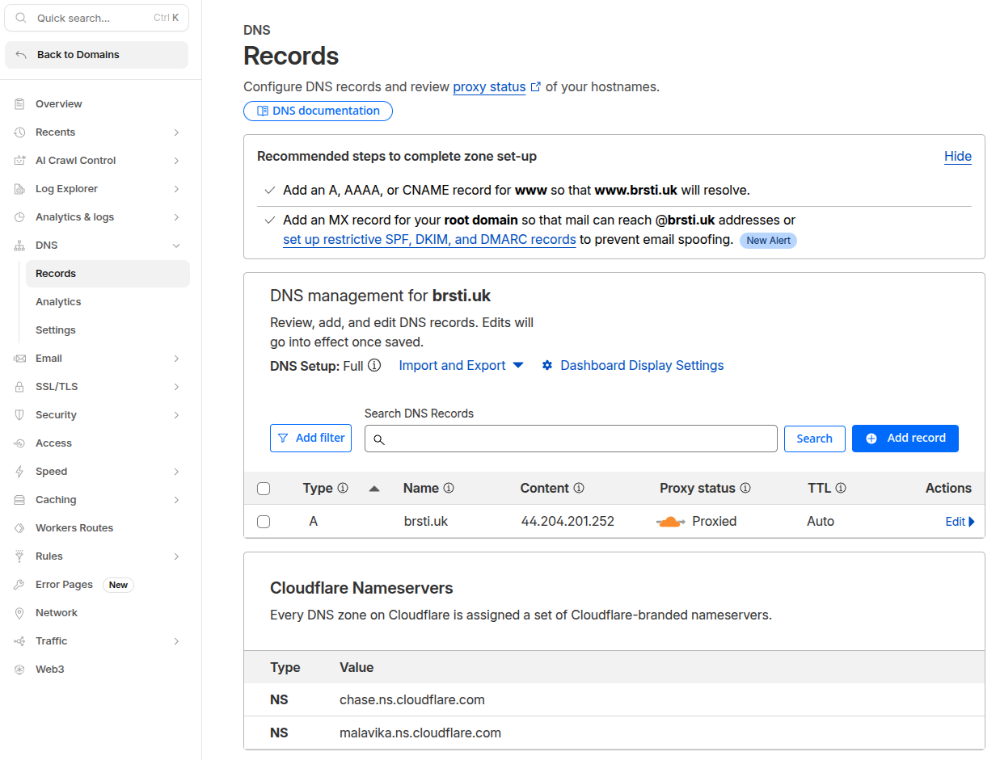
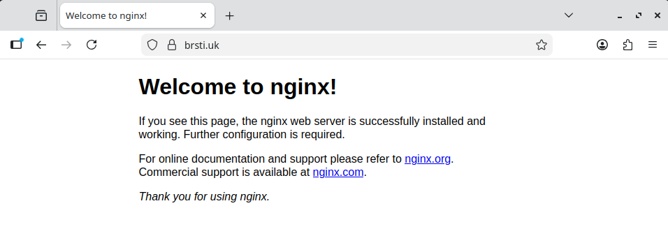

# Lab: Nginx Web Server on EC2 with Cloudflare DNS

**Objective:** Deploy a publicly accessible Nginx web server on AWS EC2 and point a custom domain to it via Cloudflare DNS.

**Prerequisites:** AWS account, Cloudflare account, SSH key pair

---

## Contents

- [Step 1. Buy a Domain (Cloudflare)](#step-1-buy-a-domain-cloudflare)
- [Step 2. Launch EC2 Instance](#step-2-launch-ec2-instance)
- [Step 3. Install & Start Nginx](#step-3-install--start-nginx)
- [Step 4. Configure DNS in Cloudflare](#step-4-configure-dns-in-cloudflare)
- [Troubleshooting](#troubleshooting)
  - [HTTPS Not Working with Cloudflare and EC2](#https-not-working-with-cloudflare-and-ec2-no-ssl-certificate)
  - [EC2 Public IP Changes on Stop/Start](#ec2-public-ip-changes-on-stopstart)

---

## Step 1. Buy a Domain (Cloudflare)

1. Cloudflare dashboard → **Domains** → **Buy a domain**
2. Search and purchase your domain

> Domain used: `brsti.uk`

---

## Step 2. Launch EC2 Instance

**Launch settings:**

| Setting | Value |
|---|---|
| AMI | Ubuntu Server 24.04 LTS (HVM) |
| Instance type | t3.micro |
| Storage | 8 GB (default) |

**Security group — inbound rules:**

| Port | Protocol | Source | Purpose |
|---|---|---|---|
| 22 | SSH | Your IP | Remote access |
| 80 | HTTP | 0.0.0.0/0 | Web traffic |
| 443 | HTTPS | 0.0.0.0/0 | Secure web traffic |

> Restrict port 22 to your own IP in production. If you don't have a static IP, use `0.0.0.0/0` temporarily but be aware of the risk.

If you are applying this outside the instance configuration menu: **Actions → Security → Change security groups**

**Note your public IP** (Networking tab) — needed for DNS config.

> Instance IP: `44.204.201.252`

---

## Step 3. Install & Start Nginx

SSH into the instance:

```bash
ssh -i your-key.pem ubuntu@44.204.201.252
```

Install and start Nginx:

```bash
sudo apt update -y && sudo apt install -y nginx
sudo systemctl start nginx && sudo systemctl enable nginx
```

**Verify:**

```bash
sudo systemctl status nginx
```

This should show the service is active (running).


```bash
curl http://localhost
```

This should return the following Nginx welcome HTML:
```bash
ubuntu@ip-172-31-15-90:~$ curl http://localhost
<!DOCTYPE html>
<html>
<head>
<title>Welcome to nginx!</title>
<style>
```

Then visit `http://44.204.201.252` in a browser. You should see the Nginx welcome page.



---

## Step 4. Configure DNS in Cloudflare

Dashboard → **DNS** → **Records** → **Add record**

| Field | Value |
|---|---|
| Type | A |
| Name | @ (root domain) |
| IPv4 address | `44.204.201.252` |
| TTL | Auto |
| Proxy status | DNS only (grey cloud) |




You should now be able to access `brsti.uk`



---

## Troubleshooting

### HTTPS Not Working with Cloudflare and EC2 (No SSL Certificate)

#### Problem
After setting up an EC2 web server and pointing a domain to it via Cloudflare, HTTPS connections failed while HTTP worked fine. The site returned a "Web server is down" or connection error when accessed over HTTPS.

#### Cause
Cloudflare's automatic SSL/TLS mode selected **Full** encryption, which requires the origin server (EC2) to have a valid SSL certificate installed. Since no certificate was configured on the EC2 instance, Cloudflare could not establish a secure connection to the origin, causing HTTPS to fail.

#### Fix
1. Log into Cloudflare and select your domain
2. Go to **SSL/TLS → Overview**
3. Click **Custom** to override the automatic setting
4. Change the encryption mode from **Full** to **Flexible**
5. Save

**Flexible** mode means Cloudflare handles HTTPS between the visitor and Cloudflare, but connects to your origin server over plain HTTP — no SSL certificate required on the server.

#### Notes
- Flexible mode is suitable for simple/personal projects where ease of setup is preferred over end-to-end encryption
- For production environments, consider installing a certificate (e.g. via Let's Encrypt) and using **Full (Strict)** mode instead
- Cloudflare's automatic mode may revert the setting, so check this if HTTPS breaks again after a scheduled scan

---

### EC2 Public IP Changes on Stop/Start

#### Problem
Every time an EC2 instance is stopped and started, AWS assigns it a new public IP address. This means any DNS records pointing to the old IP will break, and the domain will stop resolving to the correct server.

> **Note:** Rebooting an instance does not change the public IP — only a full stop/start cycle does.

#### Impact
If your Cloudflare DNS A record is pointing to your EC2 public IP and the instance is stopped and restarted, visitors will be unable to reach your site until the DNS record is manually updated with the new IP.

#### Fix 1: Manually Update DNS (Temporary Projects)
If the server is only running short-term, the simplest approach is to manually update the Cloudflare DNS record each time the IP changes:
1. Go to **EC2 → Instances** and copy the new public IP
2. Log into Cloudflare and select your domain
3. Go to **DNS → Records**
4. Edit the A record and replace the old IP with the new one
5. Save

DNS propagation through Cloudflare is usually near-instant.

#### Fix 2: Elastic IP (Permanent Projects)
For a long-running server, an Elastic IP is the recommended solution. This is a static public IP that stays attached to your account and doesn't change when the instance stops and starts.

**Setting up an Elastic IP:**
1. Go to **EC2 → Elastic IPs → Allocate Elastic IP address**
2. Click **Allocate**
3. Select the new IP → **Actions → Associate Elastic IP address**
4. Choose your instance and click **Associate**
5. Update your Cloudflare DNS A record with the Elastic IP

**Pricing:**
- Free while associated with a running instance
- ~$0.005/hr (~£2.80/month) if the instance is stopped or the IP is unassociated
- Always release the Elastic IP when terminating an instance to avoid unnecessary charges
