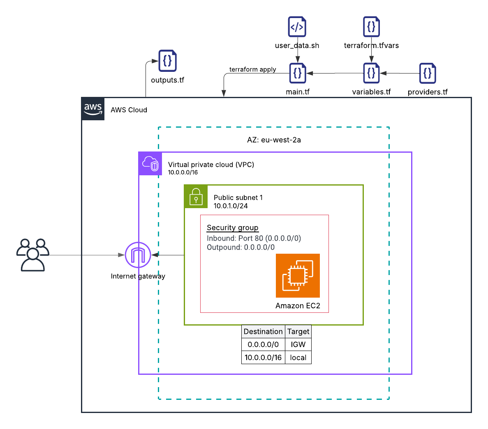

# Lab 01 - Deploy WordPress Using Terraform

## Objective

Use Terraform to deploy a full WordPress stack on AWS.

Your setup should include:

- EC2 instance running WordPress
- Security groups
- User data to install dependencies
- A working public endpoint
- All resources provisioned via Terraform

This lab shows you how Terraform manages real infrastructure end-to-end.


## Minimum Requirements

- `main.tf` - AWS provider, EC2 resource and required settings
- `variables.tf` - input variables
- `outputs.tf` - instance details
- User data script embedded or referenced
- A successful WordPress installation

## Architecture




---

### Step 1 - Create Project Folder

```bash
mkdir my-terraform-wordpress-project
cd my-terraform-wordpress-project
```

> Terraform treats each directory as a separate project. All `.tf` files inside are loaded together when you run `terraform init`.

---

### Step 2 - Providers

`touch providers.tf`

```hcl
terraform {
  required_providers {
    aws = {
      source  = "hashicorp/aws"
      version = "6.41.0"
    }
  }
}

provider "aws" {
  region = var.aws_region
}
```

> `required_providers` tells Terraform which plugin to download and which version to use. The `provider` block configures it - here we set the AWS region using a variable so it's not hardcoded.

---

### Step 3 - Variables

`touch variables.tf`

```hcl
variable "aws_region" {
  type        = string
  description = "AWS region to deploy into"
}

variable "instance_type" {
  type = string
}

variable "environment" {
  type        = string
  description = "Deployment environment (dev, staging, prod)"
}

variable "availability_zone" {
  type        = string
  description = "The availability zone the subnet is associated to"

}
```

> Variables declare what inputs your configuration accepts. They have no values here - that comes from `terraform.tfvars`. Keeping declarations and values separate means you can change values without touching your configuration.

---

### Step 4 - Assign values to variables

`touch terraform.tfvars`

```hcl
aws_region        = "eu-west-2"
instance_type     = "t3.micro"
environment       = "dev"
availability_zone = "eu-west-2a"
```

> Terraform automatically loads `terraform.tfvars` and assigns these values to the matching variables. This is where environment-specific values live - you could have a `prod.tfvars` with different values and apply it with `terraform apply -var-file="prod.tfvars"`.

---

### Step 5 - User Data

`touch user_data.sh`
```bash
#!/bin/bash
apt-get update -y
apt-get install -y apache2 mariadb-server php php-mysql libapache2-mod-php wget

systemctl enable --now apache2 mariadb

mysql -u root <<EOF
CREATE DATABASE wordpress;
CREATE USER 'wp_user'@'localhost' IDENTIFIED BY 'password123';
GRANT ALL ON wordpress.* TO 'wp_user'@'localhost';
FLUSH PRIVILEGES;
EOF

cd /tmp
wget https://wordpress.org/latest.tar.gz
tar -xzf latest.tar.gz
rm /var/www/html/index.html
cp -r wordpress/* /var/www/html/
chown -R www-data:www-data /var/www/html
```

> User data is a shell script that runs once when the EC2 instance first boots. AWS passes it to the instance via metadata. It installs Apache, MariaDB, PHP, and WordPress automatically so the instance is ready without any manual SSH.

---

### Step 6 - Create resources

`touch main.tf`

```hcl
//VPC:
resource "aws_vpc" "my_vpc" {
  cidr_block           = "10.0.0.0/16"
  enable_dns_support   = true
  enable_dns_hostnames = true
  tags = {
    Name        = "lab01-vpc"
    Environment = var.environment
  }
}

//IGW:
resource "aws_internet_gateway" "my_igw" {
  vpc_id = aws_vpc.my_vpc.id
  tags = {
    Name        = "lab01-igw"
    Environment = var.environment
  }
}

//Subnets:
resource "aws_subnet" "my_subnet" {
  vpc_id                  = aws_vpc.my_vpc.id
  cidr_block              = "10.0.1.0/24"
  availability_zone       = var.availability_zone
  map_public_ip_on_launch = true
  tags = {
    Name        = "lab01-subnet"
    Environment = var.environment
  }
}

//Route Table:
resource "aws_route_table" "my_rt" {
  vpc_id = aws_vpc.my_vpc.id
  route {
    cidr_block = "0.0.0.0/0"
    gateway_id = aws_internet_gateway.my_igw.id
  }
  tags = {
    Name        = "lab01-rt"
    Environment = var.environment
  }
}

//Associate route tablet with subnet:
resource "aws_route_table_association" "my_rta" {
  subnet_id      = aws_subnet.my_subnet.id
  route_table_id = aws_route_table.my_rt.id
}

resource "aws_security_group" "my_sg" {
  vpc_id = aws_vpc.my_vpc.id
  ingress {
    from_port   = 80
    to_port     = 80
    protocol    = "tcp"
    cidr_blocks = ["0.0.0.0/0"]
  }

  egress {
    from_port   = 0
    to_port     = 0
    protocol    = "-1"
    cidr_blocks = ["0.0.0.0/0"]
  }

  tags = {
    Name        = "lab01-sg"
    Environment = var.environment
  }
}

resource "aws_instance" "my_ec2" {
  ami                    = "ami-052c9005e24cd7236"
  instance_type          = var.instance_type
  subnet_id              = aws_subnet.my_subnet.id
  vpc_security_group_ids = [aws_security_group.my_sg.id]
  user_data              = file("${path.module}/user_data.sh")

  tags = {
    Name        = "lab01-ec2"
    Environment = var.environment
  }
}
```

> Resources are the actual AWS infrastructure Terraform creates. Each resource has a type (`aws_instance`), a local name (`my_ec2`), and arguments. Terraform figures out the dependency order automatically - it knows to create the VPC before the subnet because the subnet references `aws_vpc.my_vpc.id`.

---

### Step 7 - Outputs

`touch outputs.tf`

```hcl
output "public_ip" {
  description = "Public IP of the WordPress instance"
  value       = aws_instance.my_ec2.public_ip
}

output "public_dns" {
  description = "Public DNS name of the WordPress instance"
  value       = aws_instance.my_ec2.public_dns
}

output "wordpress_url" {
  description = "URL to open in your browser to finish WordPress setup"
  value       = "http://${aws_instance.my_ec2.public_ip}"
}
```

> Outputs print values after `terraform apply` completes. They also expose values to other configurations if this were used as a module. Without outputs you would have to log into the AWS console to find the IP.

---

### Step 8 - Workflow

`terraform init`
  


> Downloads the AWS provider plugin and sets up the `.terraform` directory. Must be run once before anything else, and again any time you add a new provider or module.

---

`terraform plan`


> Shows a preview of what Terraform will create, change, or destroy - without making any changes. Always review the plan before applying. Resources marked `+` will be created.

---

`terraform apply` - confirm `yes`


> Creates all resources in the correct order and writes the resulting state to `terraform.tfstate`. Once complete, outputs are printed - copy the `wordpress_url` and open it in your browser.

---

`terraform destroy` - confirm `yes`


> Destroys all resources tracked in the state file. Always destroy lab infrastructure when you are done to avoid unexpected AWS charges.

---

## Part 2 - Modularise

### Step 1 - Create the folder structure

```bash
mkdir -p modules/vpc
mkdir -p modules/ec2
```

> Each module is a directory containing its own `.tf` files. Terraform treats them as isolated units - they can only access values you explicitly pass in as variables.

---

### Step 2 - VPC module

#### 2.1 - modules/vpc/variables.tf

`touch modules/vpc/variables.tf`

```hcl
variable "vpc_cidr" {
  type        = string
  description = "CIDR block for the VPC"
}

variable "subnet_cidr" {
  type        = string
  description = "CIDR block for the public subnet"
}

variable "availability_zone" {
  type        = string
  description = "Availability zone for the subnet"
}

variable "environment" {
  type        = string
  description = "Deployment environment"
}
```

> These are the inputs the VPC module requires. The CIDRs are now variables instead of hardcoded values, making the module reusable across environments.

#### 2.2 - modules/vpc/main.tf

`touch modules/vpc/main.tf`

Move VPC, IGW, subnet, route table, and association from your root `main.tf`. Replace hardcoded CIDRs with variables.

```hcl
resource "aws_vpc" "my_vpc" {
  cidr_block           = var.vpc_cidr
  enable_dns_support   = true
  enable_dns_hostnames = true
  tags = {
    Name        = "lab01-vpc"
    Environment = var.environment
  }
}

resource "aws_internet_gateway" "my_igw" {
  vpc_id = aws_vpc.my_vpc.id
  tags = {
    Name        = "lab01-igw"
    Environment = var.environment
  }
}

resource "aws_subnet" "my_subnet" {
  vpc_id                  = aws_vpc.my_vpc.id
  cidr_block              = var.subnet_cidr
  availability_zone       = var.availability_zone
  map_public_ip_on_launch = true
  tags = {
    Name        = "lab01-subnet"
    Environment = var.environment
  }
}

resource "aws_route_table" "my_rt" {
  vpc_id = aws_vpc.my_vpc.id
  route {
    cidr_block = "0.0.0.0/0"
    gateway_id = aws_internet_gateway.my_igw.id
  }
  tags = {
    Name        = "lab01-rt"
    Environment = var.environment
  }
}

resource "aws_route_table_association" "my_rta" {
  subnet_id      = aws_subnet.my_subnet.id
  route_table_id = aws_route_table.my_rt.id
}
```

> All networking resources live here. The route table and association are what give the subnet internet access - without them the EC2 instance would have no route out to the internet even with an IGW attached.

#### 2.3 - modules/vpc/outputs.tf

`touch modules/vpc/outputs.tf`

Expose `vpc_id` and `subnet_id` so the EC2 module can reference them:

```hcl
output "vpc_id" {
  value = aws_vpc.my_vpc.id
}

output "subnet_id" {
  value = aws_subnet.my_subnet.id
}
```

> Outputs are how a module exposes values to the outside world. Without these, the root `main.tf` would have no way to get the `vpc_id` and `subnet_id` to pass into the EC2 module.

---

### Step 3 - EC2 module

#### 3.1 - modules/ec2/variables.tf

`touch modules/ec2/variables.tf`

The EC2 module needs `vpc_id` and `subnet_id` passed in from the VPC module - modules cannot access other modules directly.

```hcl
variable "environment" {
  type        = string
  description = "Deployment environment (dev, staging, prod)"
}

variable "instance_type" {
  type = string
}

variable "vpc_id" {
  type        = string
  description = "VPC ID to attach the security group to"
}

variable "subnet_id" {
  type        = string
  description = "Subnet ID to place the EC2 instance in"
}

variable "user_data" {
  type        = string
  description = "User data script to run on boot"
  default     = null
}
```

> `vpc_id` and `subnet_id` are required inputs because this module cannot reach into the VPC module directly - modules are isolated. They must be passed in from the root. `user_data` has a default of `null` making it optional.

#### 3.2 - modules/ec2/main.tf

`touch modules/ec2/main.tf`

```hcl
resource "aws_security_group" "my_sg" {
  vpc_id = var.vpc_id
  ingress {
    from_port   = 80
    to_port     = 80
    protocol    = "tcp"
    cidr_blocks = ["0.0.0.0/0"]
  }

  egress {
    from_port   = 0
    to_port     = 0
    protocol    = "-1"
    cidr_blocks = ["0.0.0.0/0"]
  }

  tags = {
    Name        = "lab01-sg"
    Environment = var.environment
  }
}

resource "aws_instance" "my_ec2" {
  ami                    = "ami-052c9005e24cd7236"
  instance_type          = var.instance_type
  subnet_id              = var.subnet_id
  vpc_security_group_ids = [aws_security_group.my_sg.id]
  user_data              = var.user_data

  tags = {
    Name        = "lab01-ec2"
    Environment = var.environment
  }
}
```

> Notice `vpc_id` and `subnet_id` are now `var.vpc_id` and `var.subnet_id` - not direct resource references. The security group and instance both live in this module, so the SG can still be referenced directly as `aws_security_group.my_sg.id`.

#### 3.3 - modules/ec2/outputs.tf

`touch modules/ec2/outputs.tf`

```hcl
output "public_ip" {
  value = aws_instance.my_ec2.public_ip
}

output "public_dns" {
  value = aws_instance.my_ec2.public_dns
}
```

> These expose the instance's IP and DNS so the root `outputs.tf` can surface them to the user after apply.

---

### Step 4 - Update root configuration

The root files now only wire modules together - no resources live here anymore.

#### 4.1 - Update variables.tf

Add `vpc_cidr` and `subnet_cidr`:

```hcl
variable "aws_region" {
  type        = string
  description = "AWS region to deploy into"
}

variable "instance_type" {
  type = string
}

variable "environment" {
  type        = string
  description = "Deployment environment (dev, staging, prod)"
}

variable "availability_zone" {
  type        = string
  description = "The availability zone the subnet is associated to"
}

variable "vpc_cidr" {
  type        = string
  description = "CIDR block for the VPC"
}

variable "subnet_cidr" {
  type        = string
  description = "CIDR block for the public subnet"
}
```

> `vpc_cidr` and `subnet_cidr` are new - they were hardcoded in the flat version but are now variables so the VPC module can receive them.

#### 4.2 - Update terraform.tfvars

```hcl
aws_region        = "eu-west-2"
instance_type     = "t3.micro"
environment       = "dev"
availability_zone = "eu-west-2a"
vpc_cidr          = "10.0.0.0/16"
subnet_cidr       = "10.0.1.0/24"
```

> Add the two new CIDR values. These get passed through root variables into the VPC module.

#### 4.3 - Update main.tf

Replace all resources with module calls:

```hcl
module "networking" {
  source            = "./modules/vpc"
  vpc_cidr          = var.vpc_cidr
  subnet_cidr       = var.subnet_cidr
  availability_zone = var.availability_zone
  environment       = var.environment
}

module "compute" {
  source        = "./modules/ec2"
  environment   = var.environment
  instance_type = var.instance_type
  vpc_id        = module.networking.vpc_id
  subnet_id     = module.networking.subnet_id
  user_data     = file("${path.root}/user_data.sh")
}
```

> The root `main.tf` is now just wiring - no resources, only module calls. `module.networking.vpc_id` is how you read an output from another module. The root is the only place that can pass values between modules.

> `user_data` is not in `variables.tf` or `terraform.tfvars` because we pass the script content directly using `file()`. It reads `user_data.sh` at plan time and passes the contents as a string into the module. No root variable needed.

#### 4.4 - Update outputs.tf

Reference module outputs instead of resources directly:

```hcl
output "public_ip" {
  description = "Public IP of the WordPress instance"
  value       = module.compute.public_ip
}

output "public_dns" {
  description = "Public DNS name of the WordPress instance"
  value       = module.compute.public_dns
}

output "wordpress_url" {
  description = "URL to open in your browser to finish WordPress setup"
  value       = "http://${module.compute.public_ip}"
}
```

> Outputs now reference `module.compute.*` instead of `aws_instance.my_ec2.*` directly. The resource no longer exists in the root - it lives inside the EC2 module, so you access it through the module's outputs.

---

### Step 5 - Validate and apply

```bash
terraform init    # re-run after adding modules
terraform validate
terraform plan
terraform apply
```

> `terraform init` must be re-run when you add modules so Terraform registers the new module paths. `terraform validate` checks for syntax and reference errors without contacting AWS - run this first to catch mistakes early.

