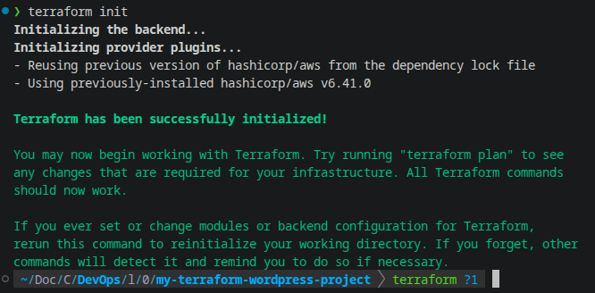
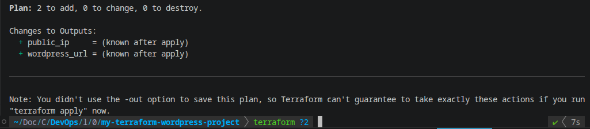
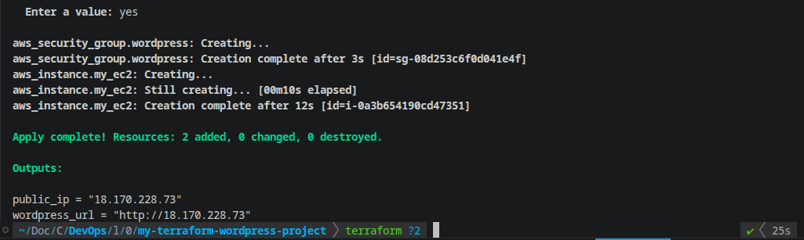
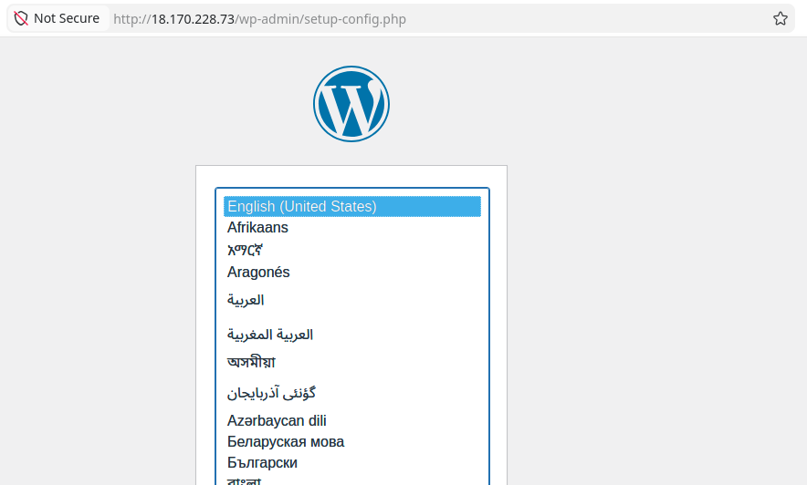
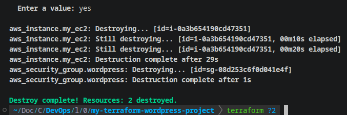

# Lab 01 - Deploy WordPress Using Terraform

## Objective

Use Terraform to deploy a full WordPress stack on AWS.

Your setup should include:

- EC2 instance running WordPress
- Security groups
- User data or cloud-init to install dependencies
- A working public endpoint
- All resources provisioned via Terraform

This lab shows you how Terraform manages real infrastructure end-to-end.

---

## Minimum Requirements

- `main.tf` - AWS provider, EC2 resource and required settings
- `variables.tf` - input variables
- `outputs.tf` - instance details
- User data script embedded or referenced
- A successful WordPress installation


---

## Step 1 - Create a Project Folder

```bash
mkdir my-terraform-wordpress-project
cd my-terraform-wordpress-project
```
---

## Step 2 - Specify providers

`touch providers.tf`

```hcl
terraform {
  required_providers {
    aws = {
      source  = "hashicorp/aws"
      version = "~> 6.0"
    }
  }
}

provider "aws" {
  region = var.aws_region
}
```
---

## Step 3 - Define variables

`touch variables.tf`

```hcl
variable "aws_region" {
  type        = string
  description = "AWS region to deploy into"
}

variable "instance_type" {
    type = string
}

variable "environment" {
  type        = string
  description = "Deployment environment (dev, staging, prod)"
}
```

---

## Step 4 - Assign values to variables

`touch terraform.tfvars`

```hcl
aws_region    = "eu-west-2"
instance_type = "t3.micro"
environment   = "dev"
```

---

## Step 5 - Create script

`touch user_data.sh`
```sh
#!/bin/bash
apt-get update -y
apt-get install -y apache2 mariadb-server php php-mysql libapache2-mod-php wget

systemctl enable --now apache2 mariadb

mysql -u root <<EOF
CREATE DATABASE wordpress;
CREATE USER 'wp_user'@'localhost' IDENTIFIED BY 'password123';
GRANT ALL ON wordpress.* TO 'wp_user'@'localhost';
FLUSH PRIVILEGES;
EOF

cd /tmp
wget https://wordpress.org/latest.tar.gz
tar -xzf latest.tar.gz
rm /var/www/html/index.html
cp -r wordpress/* /var/www/html/
chown -R www-data:www-data /var/www/html
```

---

## Step 6 - Create resources

`touch main.tf`

```hcl
resource "aws_security_group" "sg" {
  ingress {
    from_port   = 80
    to_port     = 80
    protocol    = "tcp"
    cidr_blocks = ["0.0.0.0/0"]
  }

  egress {
    from_port   = 0
    to_port     = 0
    protocol    = "-1"
    cidr_blocks = ["0.0.0.0/0"]
  }

  tags = {
    Name        = "wordpress-sg"
    Environment = var.environment
  }
}

resource "aws_instance" "my_ec2" {
  ami                         = "ami-052c9005e24cd7236"
  instance_type               = var.instance_type
  vpc_security_group_ids      = [aws_security_group.sg.id]
  user_data                   = file("${path.module}/user_data.sh")
  associate_public_ip_address = true

  tags = {
    Name        = "wordpress-ec2"
    Environment = var.environment
  }
}
```

---

## Step 7 - Print output

`touch outputs.tf`

```hcl
output "public_ip" {
  description = "Public IP of the WordPress instance"
  value       = aws_instance.my_ec2.public_ip
}

output "public_dns" {
  description = "Public DNS name of the WordPress instance"
  value       = aws_instance.my_ec2.public_dns
}

output "wordpress_url" {
  description = "URL to open in your browser to finish WordPress setup"
  value       = "http://${aws_instance.my_ec2.public_ip}"
}

```


---

## Step 8 - Workflow

- Initialise terraform - `terraform init`



- Review configuration - `terraform plan`



- Apply config - `terraform apply` - confirm `yes`






- Delete all - `terraform destroy` - confirm `yes`

