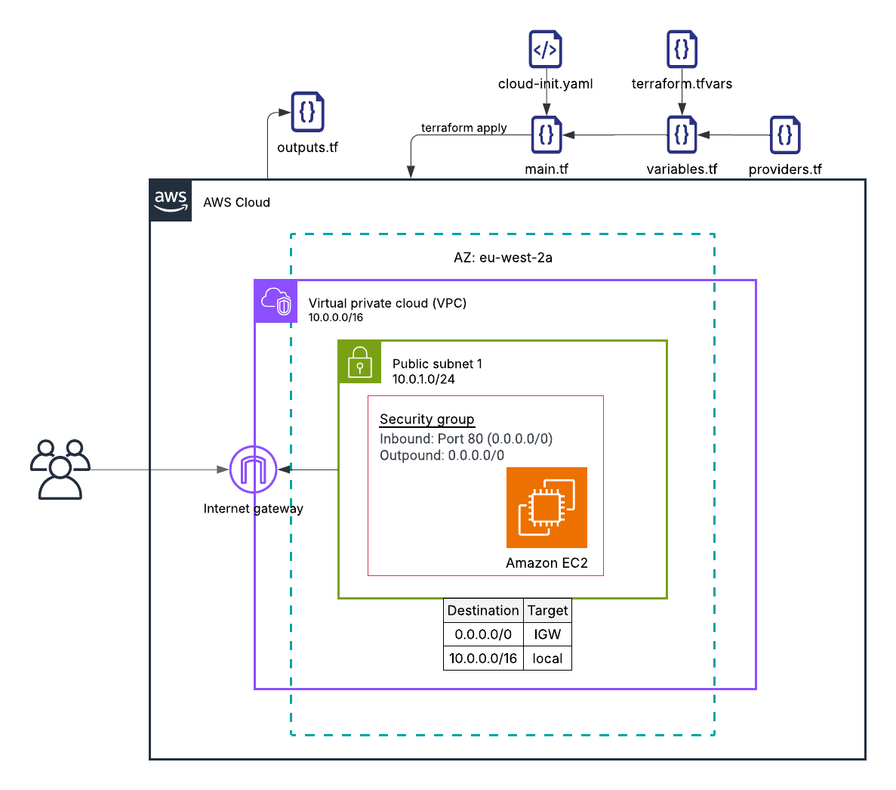
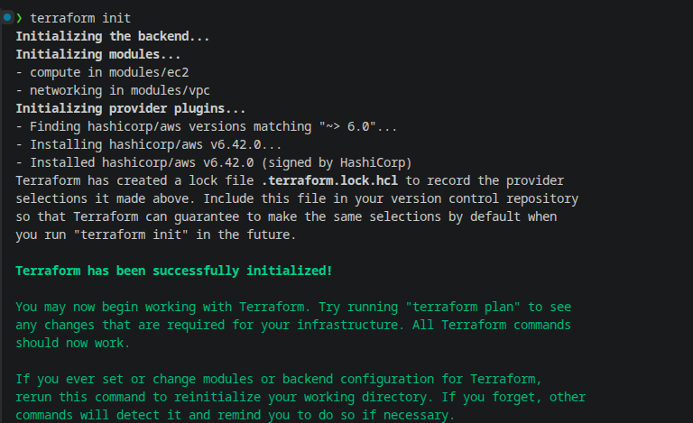
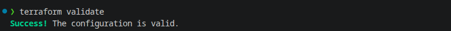
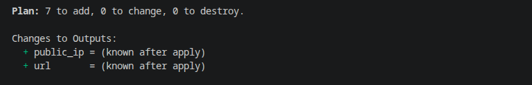
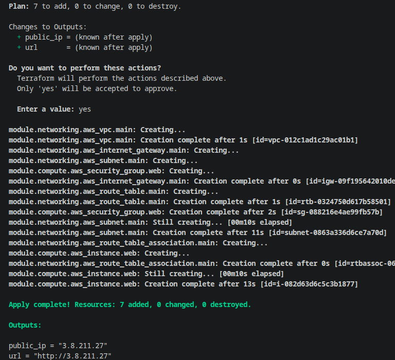
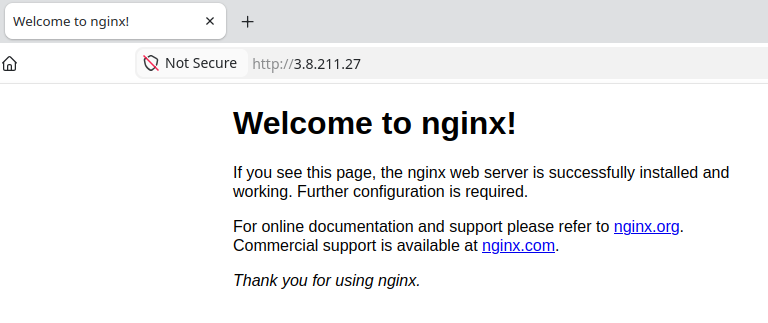
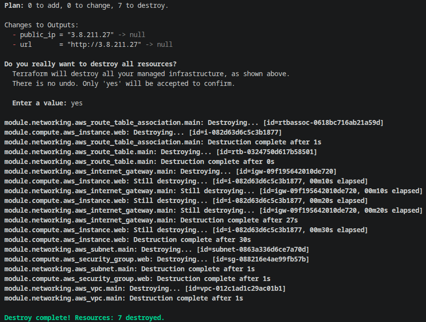

# Lab 02 - EC2 Deployment with Cloud-Init

## Objective

Configure a [cloud-init](https://developer.hashicorp.com/terraform/tutorials/provision/cloud-init) file and use Terraform to automate an EC2 deployment using modules.

Your setup should include:

- A cloud-init YAML file
- Software installed and configured on boot (NGINX)
- Cloud-init passed to the EC2 instance through Terraform
- Instance comes online fully configured with no manual steps
- All resources provisioned via Terraform with a modular structure

---

## What You Should Demonstrate

- How cloud-init differs from a bash user data script
- How Terraform passes `user_data` to an EC2 instance
- How to structure Terraform using reusable modules

---

## Architecture

- Custom VPC with public subnet
- EC2 instance running NGINX via cloud-init
- Modular structure: `modules/vpc` and `modules/ec2`



---

## Step 1 - Create the project folder and module structure

```bash
mkdir my-terraform-cloud-init
cd my-terraform-cloud-init
mkdir -p modules/vpc
mkdir -p modules/ec2
```

---

## Step 2 - providers.tf

`touch providers.tf`

```hcl
terraform {
  required_providers {
    aws = {
      source  = "hashicorp/aws"
      version = "~> 6.0"
    }
  }
}

provider "aws" {
  region = var.aws_region
}
```

---

## Step 3 - variables.tf

`touch variables.tf`

```hcl
variable "aws_region" {
  type        = string
  description = "AWS region to deploy into"
}

variable "instance_type" {
  type        = string
  description = "EC2 instance type"
}

variable "environment" {
  type        = string
  description = "Deployment environment (dev, staging, prod)"
}

variable "availability_zone" {
  type        = string
  description = "Availability zone for the subnet"
}

variable "vpc_cidr" {
  type        = string
  description = "CIDR block for the VPC"
}

variable "subnet_cidr" {
  type        = string
  description = "CIDR block for the public subnet"
}
```

---

## Step 4 - terraform.tfvars

`touch terraform.tfvars`

```hcl
aws_region        = "eu-west-2"
instance_type     = "t3.micro"
environment       = "dev"
availability_zone = "eu-west-2a"
vpc_cidr          = "10.0.0.0/16"
subnet_cidr       = "10.0.1.0/24"
```

---

## Step 5 - cloud-init.yaml

`touch cloud-init.yaml`

```yaml
#cloud-config
package_update: true
package_upgrade: true

packages:
  - nginx

runcmd:
  - systemctl enable nginx
  - systemctl start nginx
```

> Unlike a bash script, cloud-init is declarative - you describe what you want installed and running, not the steps to get there. AWS passes this file to the instance via metadata on first boot.

---

## Step 6 - VPC module

#### modules/vpc/variables.tf

`touch modules/vpc/variables.tf`

```hcl
variable "vpc_cidr" {
  type        = string
  description = "CIDR block for the VPC"
}

variable "subnet_cidr" {
  type        = string
  description = "CIDR block for the public subnet"
}

variable "availability_zone" {
  type        = string
  description = "Availability zone for the subnet"
}

variable "environment" {
  type        = string
  description = "Deployment environment"
}
```

#### modules/vpc/main.tf

`touch modules/vpc/main.tf`

```hcl
resource "aws_vpc" "main" {
  cidr_block           = var.vpc_cidr
  enable_dns_support   = true
  enable_dns_hostnames = true
  tags = {
    Name        = "lab02-vpc"
    Environment = var.environment
  }
}

resource "aws_internet_gateway" "main" {
  vpc_id = aws_vpc.main.id
  tags = {
    Name        = "lab02-igw"
    Environment = var.environment
  }
}

resource "aws_subnet" "main" {
  vpc_id                  = aws_vpc.main.id
  cidr_block              = var.subnet_cidr
  availability_zone       = var.availability_zone
  map_public_ip_on_launch = true
  tags = {
    Name        = "lab02-subnet"
    Environment = var.environment
  }
}

resource "aws_route_table" "main" {
  vpc_id = aws_vpc.main.id
  route {
    cidr_block = "0.0.0.0/0"
    gateway_id = aws_internet_gateway.main.id
  }
  tags = {
    Name        = "lab02-rt"
    Environment = var.environment
  }
}

resource "aws_route_table_association" "main" {
  subnet_id      = aws_subnet.main.id
  route_table_id = aws_route_table.main.id
}
```

#### modules/vpc/outputs.tf

`touch modules/vpc/outputs.tf`

```hcl
output "vpc_id" {
  value = aws_vpc.main.id
}

output "subnet_id" {
  value = aws_subnet.main.id
}
```

---

## Step 7 - EC2 module

#### modules/ec2/variables.tf

`touch modules/ec2/variables.tf`

```hcl
variable "environment" {
  type        = string
  description = "Deployment environment (dev, staging, prod)"
}

variable "instance_type" {
  type = string
}

variable "vpc_id" {
  type        = string
  description = "VPC ID to attach the security group to"
}

variable "subnet_id" {
  type        = string
  description = "Subnet ID to place the EC2 instance in"
}

variable "user_data" {
  type        = string
  description = "Cloud-init config to run on boot"
  default     = null
}
```

#### modules/ec2/main.tf

`touch modules/ec2/main.tf`

```hcl
data "aws_ami" "ubuntu" {
  most_recent = true
  owners      = ["099720109477"]

  filter {
    name   = "name"
    values = ["ubuntu/images/hvm-ssd/ubuntu-*-22.04-amd64-server-*"]
  }

  filter {
    name   = "virtualization-type"
    values = ["hvm"]
  }
}

resource "aws_security_group" "web" {
  vpc_id = var.vpc_id
  ingress {
    from_port   = 80
    to_port     = 80
    protocol    = "tcp"
    cidr_blocks = ["0.0.0.0/0"]
  }

  egress {
    from_port   = 0
    to_port     = 0
    protocol    = "-1"
    cidr_blocks = ["0.0.0.0/0"]
  }

  tags = {
    Name        = "lab02-sg"
    Environment = var.environment
  }
}

resource "aws_instance" "web" {
  ami                    = data.aws_ami.ubuntu.id
  instance_type          = var.instance_type
  subnet_id              = var.subnet_id
  vpc_security_group_ids = [aws_security_group.web.id]
  user_data              = var.user_data

  tags = {
    Name        = "lab02-ec2"
    Environment = var.environment
  }
}
```

#### modules/ec2/outputs.tf

`touch modules/ec2/outputs.tf`

```hcl
output "public_ip" {
  value = aws_instance.web.public_ip
}

output "public_dns" {
  value = aws_instance.web.public_dns
}
```

---

## Step 8 - Root main.tf

`touch main.tf`

```hcl
module "networking" {
  source            = "./modules/vpc"
  vpc_cidr          = var.vpc_cidr
  subnet_cidr       = var.subnet_cidr
  availability_zone = var.availability_zone
  environment       = var.environment
}

module "compute" {
  source        = "./modules/ec2"
  environment   = var.environment
  instance_type = var.instance_type
  vpc_id        = module.networking.vpc_id
  subnet_id     = module.networking.subnet_id
  user_data     = file("${path.root}/cloud-init.yaml")
}
```

---

## Step 9 - Root outputs.tf

`touch outputs.tf`

```hcl
output "public_ip" {
  description = "Public IP of the instance"
  value       = module.compute.public_ip
}

output "url" {
  description = "URL to verify the instance is running"
  value       = "http://${module.compute.public_ip}"
}
```

---

## Step 10 - Workflow

```bash
terraform init
terraform validate
terraform plan
terraform apply
terraform destroy
```

`terraform init`



`terraform validate`



`terraform plan`



`terraform apply`



**test**



`terraform destroy`

